# redash-hands-on

[](https://github.com/kakakakakku/redash-hands-on/stargazers)

## 前提

Redash ハンズオン資料は以下の環境を前提に動作確認をしています．

- Docker For Mac
- Docker For Windows

## 環境構築

Docker Compose で Redash (v4.0.1) 環境を構築します．任意のディレクトリに kakakakakku/redash-hands-on リポジトリをクローンしましょう．

```sh
$ git clone https://github.com/kakakakakku/redash-hands-on.git
$ cd redash-hands-on
```

公式の getredash/redash リポジトリに公開されている設定をベースに，テストデータを事前に投入した MySQL 5.7 コンテナを含めた `docker-compose.yml` を準備しました．

以下のコマンドを実行し，Docker Compose で Redash を起動しましょう．

初回はイメージをダウンロードするため，少し時間がかかる場合があります．

```
$ docker-compose run --rm server create_db
$ docker-compose up
```

起動すると，以下の URL で Redash にアクセスできるようになります．

- http://localhost

最初に Admin User と Organization Name を登録しましょう．以下にサンプルを載せておきます．登録が完了すると，Redash にログインできます．

- Admin User
    - Name
        - `admin`
    - Email Address
        - `admin@example.com`
    - Password
        - `任意のパスワード`
- General
    - Organization Name
        - `hands-on`

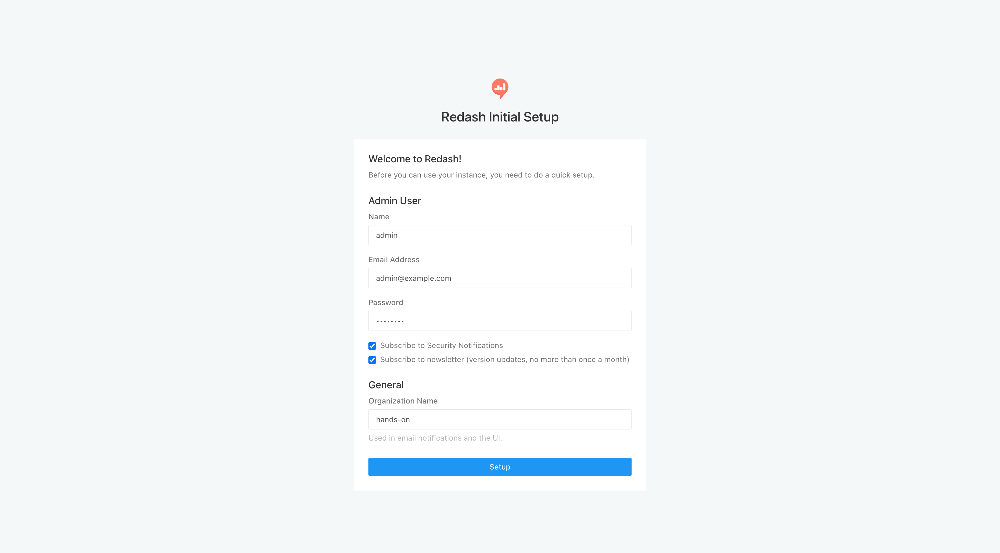

なお，Redash 環境の構築方法は Docker Compose 以外にもあります．興味のある方は，公式ドキュメントを読んでみましょう．

- [Setting up a Redash Instance | Redash](https://redash.io/help/open-source/setup)

## データソース設定

次に Redash から MySQL に接続できるように「データソース」を設定します．

ログイン後の画面にある「1. Connect a Data Source」のリンクをクリックし，「New Data Source」ボタンをクリックします．

次に右側にある「MySQL」をクリックします．「MySQL (Amazon RDS)」ではなく「MySQL」です．

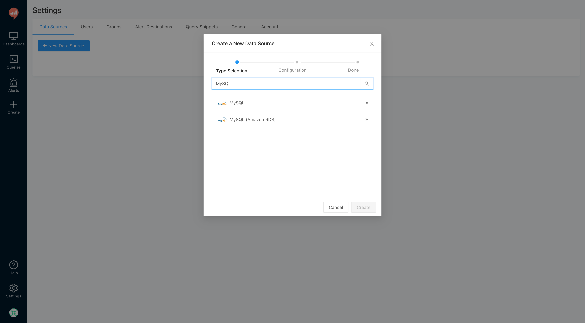

以下の通りに設定したら「Save → Test Connection」とクリックし，接続確認をしましょう．Success と画面右下に表示されます．なお，今回はテストデータとして `world` データベースを使います．

| 項目 | 値 |
| --- | --- |
| Name | MySQL |
| Host | mysql |
| Port | 3306 |
| User | root |
| Password | - |
| Database Name | world |


## 日付フォーマット設定

画面右上にある Settings アイコンをクリックし，「Settings」タブをクリックします．

日付フォーマットを以下の通りに変更します．

- General
    - Date Format
        - YYYY-MM-DD

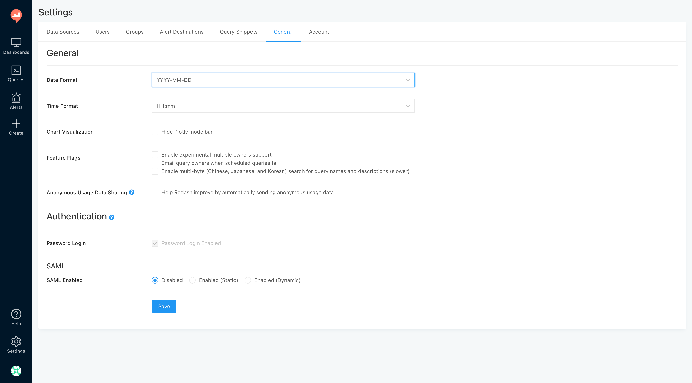

## クエリを作ってみよう

ナビバーから「Create → Query」とクリックし，以下のクエリを入力しましょう．

```sql
SELECT * FROM country;
```

入力したら「Execute」ボタンをクリックしてクエリを実行します．すると「国の一覧」が取得できます．

クエリの実行ができたら，画面左上の「New Query」という部分をクリックし，クエリタイトルを「国の一覧」に変更します．忘れずに画面右側にある「Save」ボタンをクリックしましょう．

さらに「Publish」ボタンをクリックします．Redash ではクエリを公開することで，他のユーザーに共有することができます．


## グラフを作ってみよう

先ほどと同様に新規クエリを作成し，以下のクエリを入力しましょう．実行すると，登録されている国の件数が「239」であることが取得できます．この件数をグラフにしてみましょう．

```sql
SELECT COUNT(*) AS COUNT FROM country;
```

「TABLE」 タブの横に表示されている「+ New Visualization」タブをクリックし，以下の通りに設定をします．「Save」ボタンをクリックすると，件数のグラフが表示されます．最新値など，特定の値をグラフにする場合は `Counter` が便利です．

- Visualization Type
    - `Counter`
- Visualization Name
    - `国の件数`
- Counter Value Column Name
    - `COUNT`

なお `Counter` には「目標値」を設定する機能もあります．今回のデータソースではデータ件数に変化がありませんが，サンプルとして，作ってみましょう．先ほどのクエリを以下の通りに変更します．

```sql
SELECT COUNT(*) AS COUNT, 500 AS kpi FROM country;
```

もう1度「+ New Visualization」タブをクリックし，以下の通りに設定をします．先ほどとの違いは「Target Value Column Name」の設定を追加した点です．このようにクエリを活用することで，目標値と実績値を一緒に可視化することができます．

`Counter` に「目標値」を設定した場合，値が実績を下回る場合は赤く表示され，上回る場合は緑で表示されます．

- Visualization Type
    - `Counter`
- Visualization Name
    - `国の件数（+ 目標値）`
- Counter Value Column Name
    - `COUNT`
- Target Value Column Name
    - `kpi`

クエリタイトルを「国の件数」とし，忘れずに保存と公開をしておきましょう．


## 円グラフと棒グラフを作ってみよう

クエリの作成はもう慣れたと思います．以下のクエリを作成し，実行しましょう．

国ごとに都市の件数を取得できます．中国とインドが特に多いことがわかります．

```sql
SELECT CountryCode, COUNT(*) AS COUNT
FROM city
GROUP BY CountryCode
ORDER BY COUNT DESC;
```

先ほどと同様に「+ New Visualization」タブをクリックし，以下の通りに設定をすると，円グラフを作ることができます．

- Visualization Type
    - `Chart`
- Visualization Name
    - `都市の件数`
- General
    - Chart Type
        - `Pie`
    - X Column
        - `CountryCode`
    - Y Columns
        - `COUNT`

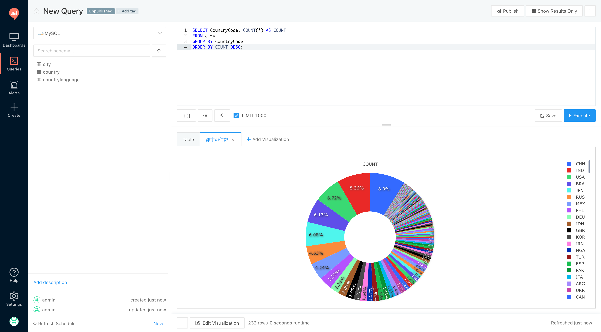

次に棒グラフも作ってみましょう．設定は以下の通りです．

- Visualization Type
    - `Chart`
- Visualization Name
    - `都市の件数（棒グラフ）`
- General
    - Chart Type
        - `Bar`
    - X Column
        - `CountryCode`
    - Y Columns
        - `COUNT`

しかし，棒グラフの場合，このままではグラフが表示されません．「GENERAL」タブの隣にある「X AXIS」タブをクリックし，軸の設定をする必要があります．

- Scale
    - `Category`
- Sort Values
    - `OFF`

これで棒グラフも作れました．

クエリタイトルを「都市の件数」とし，忘れずに保存と公開をしておきましょう．

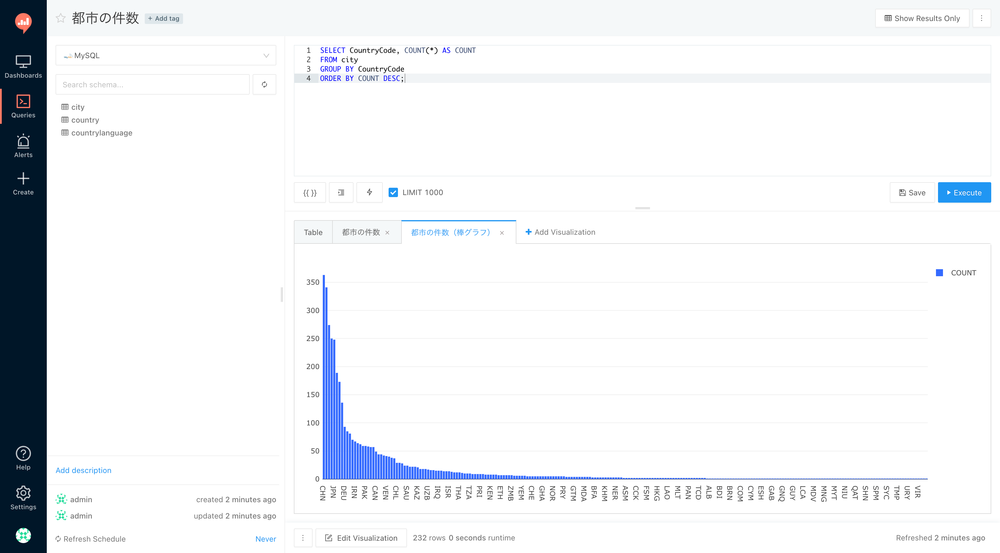

## ダッシュボードを作ってみよう

次にダッシュボードを作ってみましょう．

ナビバーから「Create → Dashboard」とクリックし，ダッシュボードタイトルに「ハンズオン:国ダッシュボード」と入力しましょう．

ポイントは `グループ名:ダッシュボード名` という命名規則にすることです．

Redash には Grouping Dashboards という機能があり，ダッシュボードタイトルにコロンを含めることで，同じグループのダッシュボードをまとめて管理することができます．詳しくは公式ドキュメントを読んでみましょう．

- [Creating and Editing Dashboards | Redash](https://redash.io/help/user-guide/dashboards/dashboard-editing)

次にダッシュボードにグラフを配置していきます．

画面右側にあるメニューから「Add Widget」をクリックします．すると「Add Widget」というモーダルが表示されるため，以下の設定を繰り返し行いましょう．レイアウトは自由に変更することができます．

- 1回目
    - Visualization
        - `国の一覧`
    - Choose Visualization
        - `Table`
- 2回目
    - Visualization
        - `国の件数`
    - Choose Visualization
        - `国の件数（+ 目標値）`
- 3回目
    - Visualization
        - `都市の件数`
    - Choose Visualization
        - `都市の件数`
- 4回目
    - Visualization
        - `都市の件数`
    - Choose Visualization
        - `都市の件数（棒グラフ）`

「Visualization」にクエリが表示されない場合は，そのクエリが公開されていないことが考えられます．

ナビバーの「Queries」で `Unpublished` 状態になっているクエリがあったら，そのクエリを公開し，再度ダッシュボードにグラフを追加してみましょう．

最後に画面右側にある「Apply Changes」をクリックし，続けて「Publish」をクリックしましょう．クエリ同様にダッシュボードも他のユーザーに共有することができます．

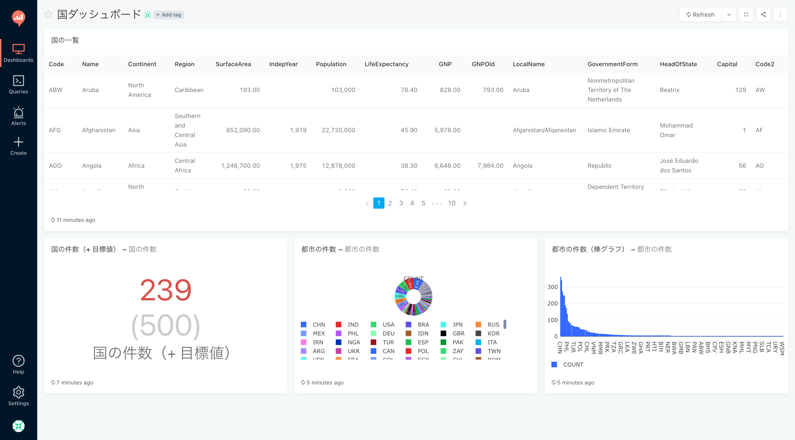

## パラメータ付きクエリを作ってみよう

次はクエリにパラメータを付けてみましょう．

Redash では，クエリに `{{}}` を含めると，その部分がパラメータになります．以下の新規クエリを作りましょう．

```sql
SELECT * FROM city WHERE CountryCode = '{{CountryCode}}' ORDER BY Population DESC;
```

すると，画面左下に「CountryCode」をパラメータとして入力するテキストエリアが表示されます．

ここに「JPN」を入力し，クエリを実行すると，日本の都市を人口の多い順に取得することができます．クエリタイトルを「都市の検索」にして保存しておきましょう．

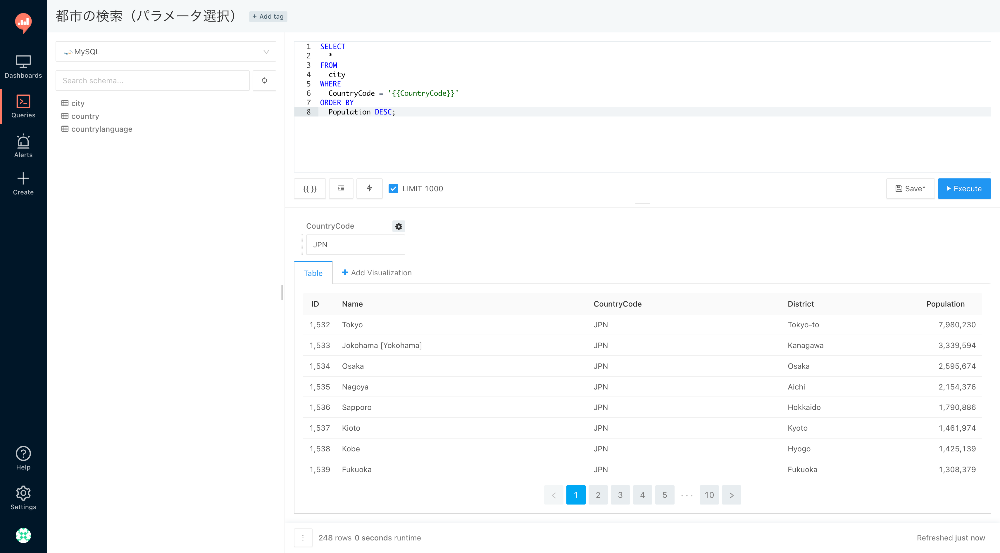

パラメータとして入力できる UI はテキストフィールド以外にもあります．名前の通り，例えば「Date」を選択すると，日付ピッカー（カレンダー）から日付を選択することができます．

- Text
- Number
- Dropdown List
- Query Based Dropdown List
- Date
- Date and Time
- Date and Time (with seconds)

今回は便利な「Dropdown List」を試しましょう．

パラメータの横にあるトグルをクリックし，「Type」を `Dropdown List` にします．さらに `Dropdown List Values (newline delimited)` に以下のリストを設定します．

```
JPN
USA
```

すると，選択肢から選べるようになるため，入力ミスを軽減できるようになります．

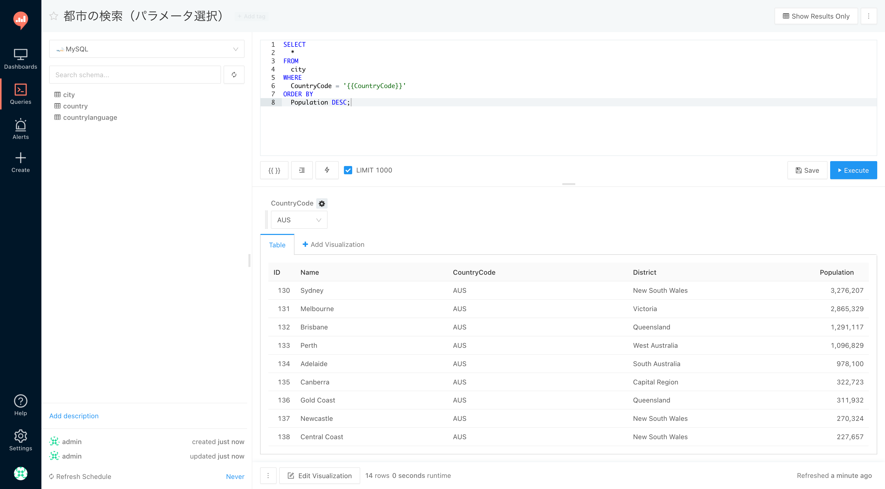

## フィルタ機能を使ってみよう

Redash では，クエリのカラム名を `カラム名::filter` もしくは `カラム名::multi-filter` という命名規則にすると，クエリ結果をフィルタできるようになります．さっそく試してみましょう．

以下の新規クエリを作成し，実行すると，クエリ結果を「CountryCode」で自由にフィルタできるようになります．これが「フィルタ機能」です．

```sql
SELECT *, CountryCode AS 'CountryCode::filter' FROM city ORDER BY Population DESC;
```

次に「マルチフィルタ機能」を試しましょう．クエリを以下のように変更すると，今度は複数の「CountryCode」でフィルタできるようになります．

```sql
SELECT *, CountryCode AS 'CountryCode::multi-filter' FROM city ORDER BY Population DESC;
```

フィルタ機能は非常に便利です．詳しくは公式ドキュメントを読んでみましょう．

- [Query Filters | Redash](https://redash.io/help/user-guide/querying/query-filters)

クエリタイトルを「都市のフィルタ」にして保存しておきましょう．


## クエリスニペットを活用しよう

Redash では，よく使うクエリ（もしくはクエリの一部）をクエリスニペットとして登録する機能があります．

画面右上にある Settings アイコンをクリックし，「Query Snippets」タブをクリックします．

次に「New Snippet」ボタンをクリックすると登録画面が表示されます．以下の設定をしたら「Save」ボタンを押しましょう．

- Trigger
    - `_country_code`
- Description
    - `国コード検索`
- Snippet
    - `WHERE CountryCode = '{{CountryCode}}'`

新規クエリを作成し，以下のクエリを入力しましょう．クエリスニペットに登録した「Trigger」に部分一致すると候補として表示されるため `_` と入力するとクエリスニペットを呼び出すことができます．

```sql
SELECT * FROM city _
```

クエリスニペットにプレースホルダを設定することもできます．

以下のように `${1:table}` と設定すると，テーブル名のプレースホルダになります．是非試してみましょう．今回はクエリスニペットの動作確認が目的ですので，クエリは保存しなくて大丈夫です．

- Trigger
    - `_record_count`
- Description
    - `レコード件数`
- Snippet
    - `SELECT COUNT(*) FROM ${1:table};`

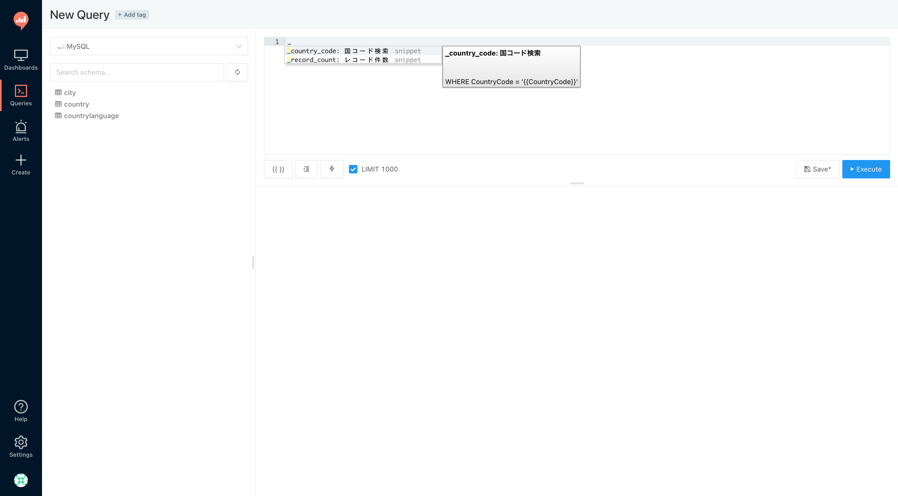

## クエリ結果に色を付けよう

Redash では，クエリ結果に HTML を埋め込むことができます．さっそく以下の新規クエリを作成してみましょう．

```sql
SELECT *,
       CASE
           WHEN Population > 1000000000 THEN '<div class="bg-success p-30 text-center">AAA</div>'
           WHEN Population > 140000000 THEN '<div class="bg-warning p-20 text-center">BBB</div>'
           ELSE '<div class="bg-danger p-10 text-center">CCC</div>'
       END AS Color
FROM country
ORDER BY Population DESC;
```

「Population」の値によって「緑黄赤」と色を変えています．さらに縦サイズも変えています．このように活用すると，よりクエリ結果を便利に使うことができます．

クエリタイトルを「国の一覧（色付き）」にして保存しておきましょう．他にも利用可能なマークアップがあり，公式ドキュメントに載っています．

- [Conditional Formatting & General Text Formatting - Tips, Tricks & Query Examples - Redash Discourse](https://discuss.redash.io/t/conditional-formatting-general-text-formatting/1706)


## リンク集を作ろう

ダッシュボードに複数のグラフを配置する場合，関連する URL などを載せておくと便利な場合があります．

ダッシュボードにフリーテキストを入力する方法もありますが，Redash では，クエリ結果に HTML を埋め込むことができるため，簡単にリンクを作成することができます．

以下の新規クエリを作成し，クエリタイトルを「リンク集」にして保存しておきましょう．

```sql
SELECT '<a href="https://www.google.co.jp/">Google</a>' AS name
UNION
SELECT '<a href="https://www.yahoo.co.jp/">Yahoo!</a>'
UNION
SELECT '<a href="https://www.bing.com/">Bing</a>';
```


## クエリ結果をダウンロードしよう

Redash では，クエリ結果をダウンロードすることができます．現状サポートされているデータ形式は CSV と Excel です．

ナビバーの「Queries」をクリックし，既に作ったクエリ「国の一覧」を開きましょう．

画面下にある「Download Dataset」ボタンを押すと，以下のメニューが表示されます．クエリ結果をダウンロードしてみましょう．

- Download as CSV File
- Download as Excel File

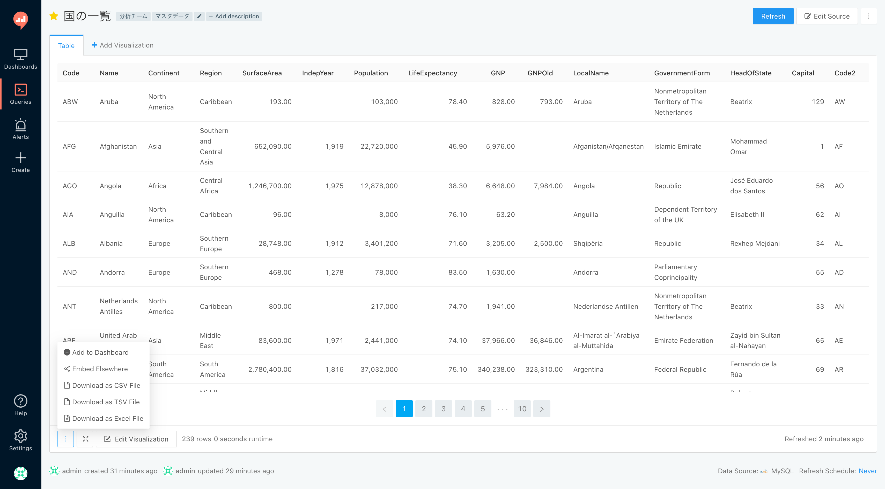

## クエリのフォーク機能を体験しよう

今回はハンズオンとして Redash を1人で使っていますが，一般的にはチームで使うことが多いと思います．

チームで使っていると「メンバーが作ったクエリを少しカスタマイズしたい」と感じる場面があります．そのために Redash には「フォーク機能」があります．

既に作ったクエリ「国の一覧」を開き，画面右上にあるプルダウンから「Fork」ボタンをクリックしましょう．すると，自動的に新規クエリが作成されます．クエリタイトルを「Copy of (#1) 国の一覧」から「国の一覧（カスタマイズ）」に変更しましょう．

クエリを自由に変更できるため，以下のクエリを入力し，実行しましょう．表示するカラムを「国コード」と「名前」と「人口」にカスタマイズできました．

```sql
SELECT Code, Name, Population FROM country;
```

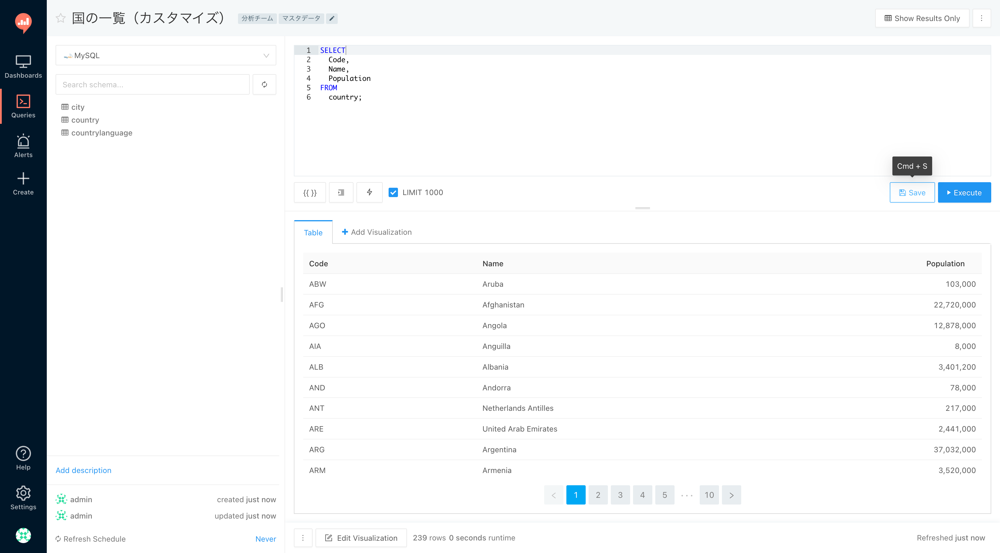

## アラートを設定しよう

Redash の機能は可視化だけではありません．特定の値が閾値を超えた場合にアラートを通知する機能があります．

Slack に Webhook 経由でアラートを通知してみましょう．今回は，自由に使える Slack アカウントがある前提で進めます．

まず，Slack で Incoming WebHooks を作成します．そのままでも使えますが，「Customize Name」に `Redash Alerts`，「Customize Icon」に Redash のロゴ画像などを設定しておくと便利です．「Webhook URL」の値は次に使います．

画面右上にある Settings アイコンをクリックし，「Alert Destinations」タブにある「New Alert Destination」ボタンをクリックしましょう．次に「Slack」をクリックし，登録画面で以下を設定します．

- Name
    - `Slack`
- Slack Webhook URL
    - `Webhook URL`

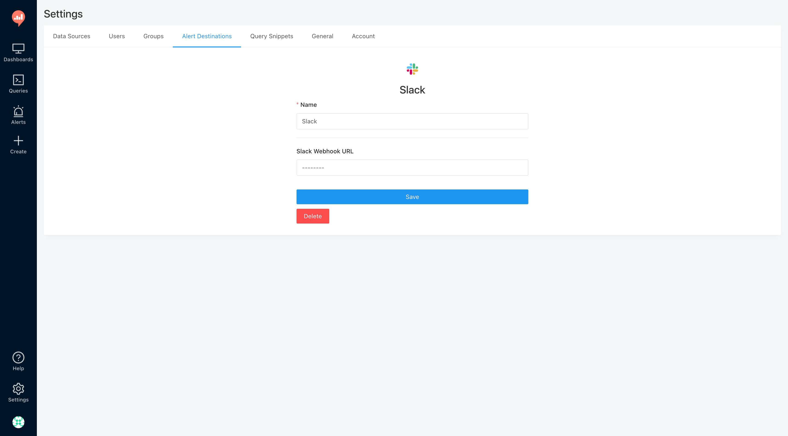

アラートを設定する前に，もう少し準備をしておく必要があります．

既に作成をした「国の件数」クエリを開き，「Refresh Schedule」を有効にする必要があります．今回は `Every 1 minute` にしましょう．

今回の例では，国の件数に変化はありませんが，定期的にクエリの実行をする機能です．アラートの設定をするクエリには「Refresh Schedule」の設定が必要です．

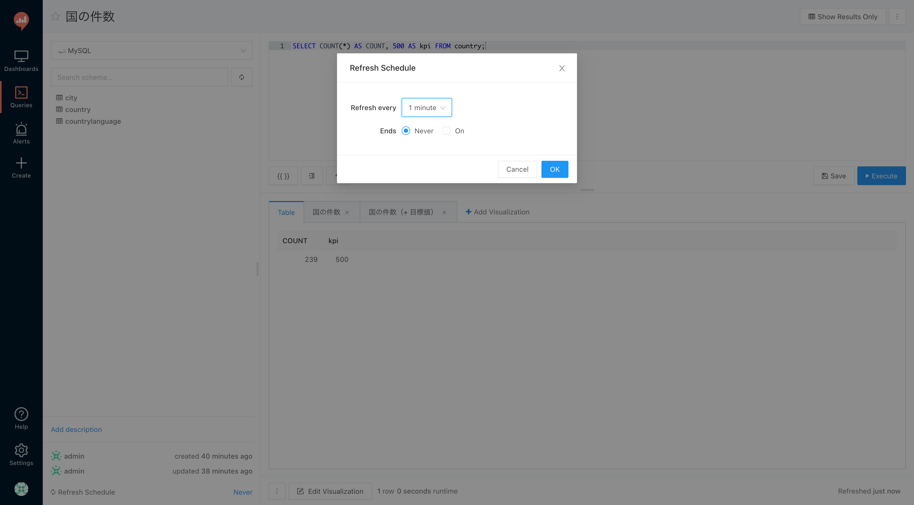

最後はアラートの設定です．ナビバーから「Create → Alert」をクリックし，「New Alert」の画面を開きます．以下のエラーが出る場合がありますが，問題ありません．

>It looks like your mail server isn't configured. Make sure to configure it for the alert emails to work.

登録画面で以下を設定します．「Rearm seconds」は，異常値が続く場合にアラートを再通知する間隔（秒数）です．

- Query
    - `国の件数`
- Name
    - `国の件数が200件を超えた場合`
- Value column
    - `COUNT`
- Op
    - `greater than`
- Reference
    - `200`
- Rearm seconds
    - `60`

「Save」をクリックすると，右側に「Notifications」のメニューが表示されるため，「Slack」を「Add」し，もう一度「Save」をクリックします．

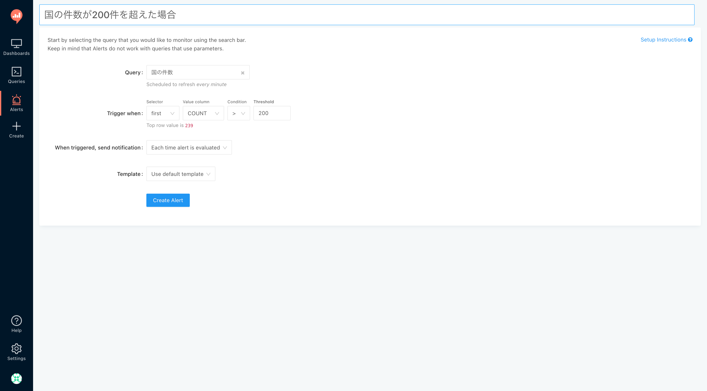

すると，Slack にアラートが通知されます．確認ができたら「Rearm seconds」をブランクにして「Save」をクリックしておきましょう．


