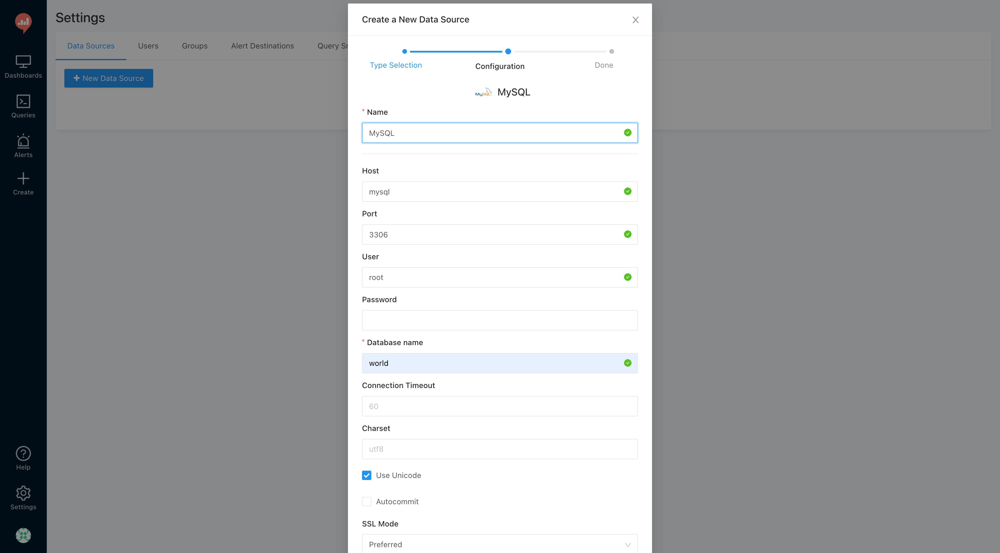
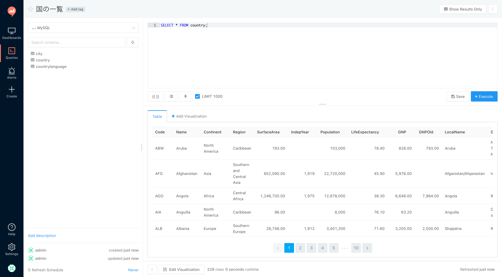

# redash-hands-on

## 環境構築

Docker Compose で Redash (v2.0.1) 環境を構築します．任意のディレクトリに Redash リポジトリをクローンし，リリースタグから v2.0.1 に切り替えましょう．

```sh
$ git clone git@github.com:getredash/redash.git
$ cd redash
$ git checkout tags/v2.0.1 -b v2.0.1
```

次に Redash からテストデータを事前に投入した MySQL 5.7 に接続できるように `docker-compose.production.yml` を変更します．以下のように変更をしましょう．

```diff
       - server
     links:
       - server:redash
+  mysql:
+    image: kakakakakku/mysql-57-world-database
+    environment:
+      MYSQL_ALLOW_EMPTY_PASSWORD: "yes"
```

変更をしたら Docker Compose で Redash を起動します．初回はイメージをダウンロードするため，少し時間がかかる場合があります．

```
$ docker-compose -f docker-compose.production.yml run --rm server create_db
$ docker-compose -f docker-compose.production.yml up
```

起動すると，以下の URL で Redash にアクセスできるようになります．

- http://localhost

最初に Admin User と Organization Name を登録しましょう．以下にサンプルを載せておきます．登録が完了すると，Redash にログインできます．

- Admin User
    - Name
        - `admin`
    - Email Address
        - `admin@example.com`
- General
    - Organization Name
        - `hands-on`


なお，Redash 環境の構築方法は Docker Compose 以外にもあります．興味のある方は，公式ドキュメントを読んでみましょう．

- [Setting up a Redash instance · Redash Help Center](https://redash.io/help-onpremise/setup/setting-up-redash-instance.html)

## データソース設定

次に Redash から MySQL に接続できるように「データソース」を設定します．

画面右上にあるデータソースアイコンをクリックし，次に「New Data Source」ボタンをクリックします．

以下の通りに設定したら「Save → Test Connection」とクリックし，接続確認をしましょう．Success と画面右下に表示されます．なお，今回はテストデータとして `world` データベースを使います．

| 項目 | 値 |
| --- | --- |
| Type | MySQL |
| Name | MySQL |
| Host | mysql |
| Port | 3306 |
| User | root |
| Password | - |
| Database name | world |
| Path to private key file (SSL) | - |
| Path to client certificate file (SSL) | - |
| Path to CA certificate file to verify peer against (SSL) | - |



## クエリを作ってみよう

ナビバーから「Queries → New Query」とクリックし，以下のクエリを入力しましょう．

```sql
SELECT * FROM country;
```

入力したら「Execute」ボタンをクリックしてクエリを実行します．すると「国の一覧」が取得できます．

クエリの実行ができたら，画面左上の「New Query」という部分をクリックし，クエリタイトルを「国の一覧」に変更します．忘れずに画面右側にある「Save」ボタンをクリックしましょう．

さらに「Publish」ボタンをクリックします．Redash ではクエリを公開することで，他のユーザーに共有することができます．

