# redash-hands-on

## Prerequisites

This Redash hands-on tutorial has been tested in the following environment.

- Docker Desktop for Mac

## Setup

Let's set up a **Redash (v26.3.0)** environment with Docker Compose. Clone the `kakakakakku/redash-hands-on` repository into any directory.

```sh
$ git clone https://github.com/kakakakakku/redash-hands-on.git
$ cd redash-hands-on
```

Based on the configuration published in the official getredash/redash repository, this repository provides a `compose.yaml` that also includes a MySQL 8.4 container preloaded with test data.

Run the following commands to start Redash with Docker Compose.

The first run may take a while because the images need to be downloaded.

```sh
$ docker compose run --rm server create_db
$ docker compose up -d
```

Once it starts, Redash is available at the following URL.

- http://localhost:5001

First, register an Admin User and an Organization Name. Here is an example. After filling in the form, click "Setup".

- Admin User
    - Name
        - `admin`
    - Email Address
        - `admin@example.com`
    - Password
        - `any password`
- General
    - Organization Name
        - `hands-on`

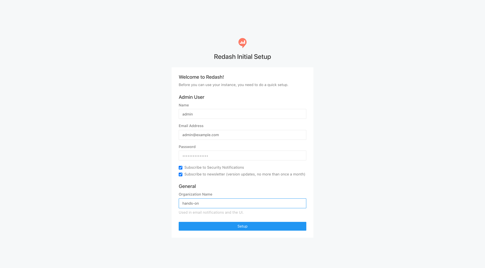

You are now logged in to Redash.

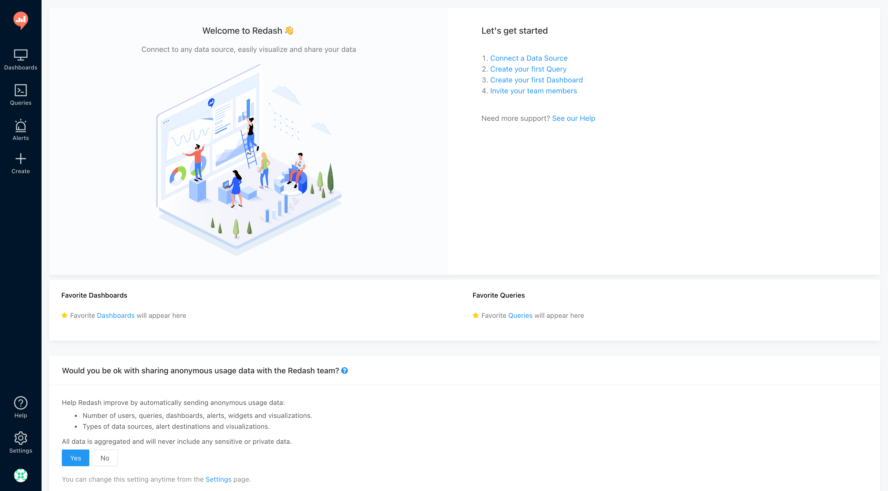

Note that there are other ways to set up a Redash environment besides Docker Compose. If you are interested, take a look at the official documentation.

- [Setting up a Redash Instance | Redash](https://redash.io/help/open-source/setup/)

## Configuring a Data Source

Next, let's configure a "data source" so that Redash can connect to MySQL.

Click the "1. Connect a Data Source" link on the screen shown after logging in.

Type "MySQL" into the "Search..." form and click the first "MySQL" entry. Make sure to pick "MySQL", not "MySQL (Amazon RDS)".

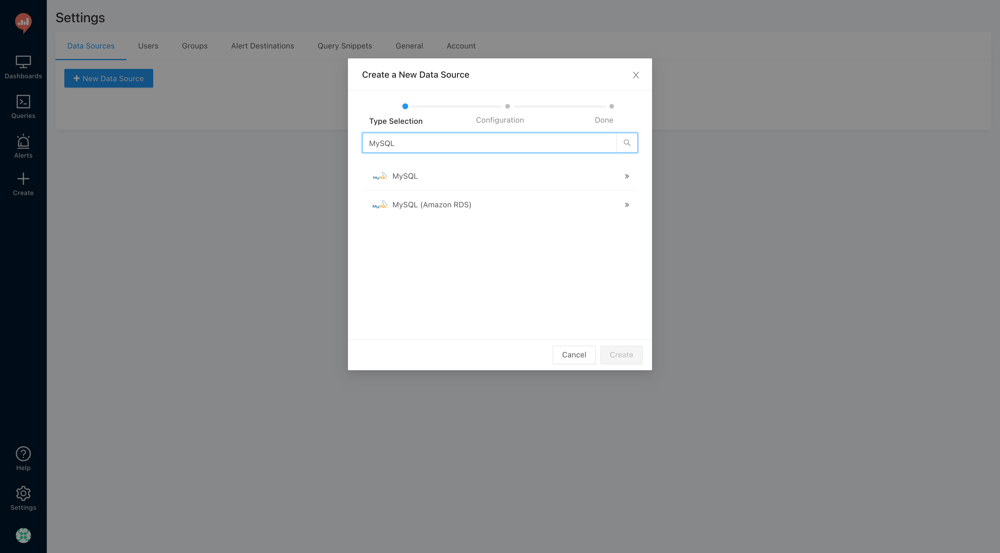

Fill in the form as follows, then click "Create → Test Connection" to verify the connection. You will see "Success" at the bottom right of the screen. In this tutorial we use the `world` database as test data.

| Item | Value |
| --- | --- |
| Name | MySQL |
| Host | mysql |
| Port | 3306 |
| User | root |
| Password | - |
| Database name | world |

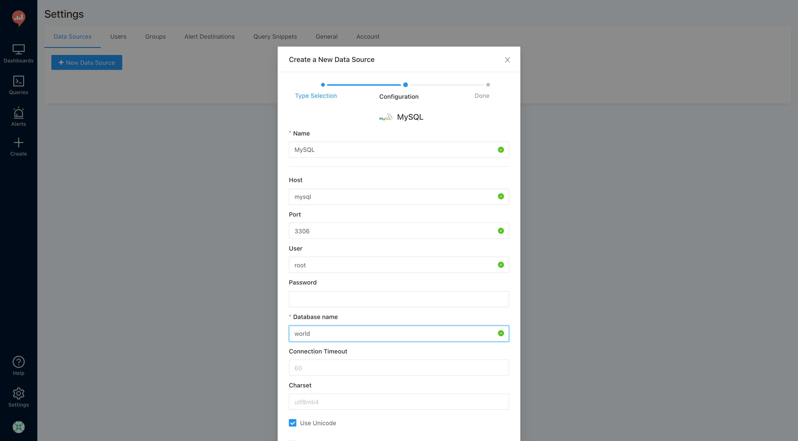

## Configuring the Date Format

Click the Settings icon at the bottom left of the screen, then click the "General" tab.

Change the date format as follows. After changing it, click the "Save" button.

- General
    - Date Format
        - `MM/DD/YY`

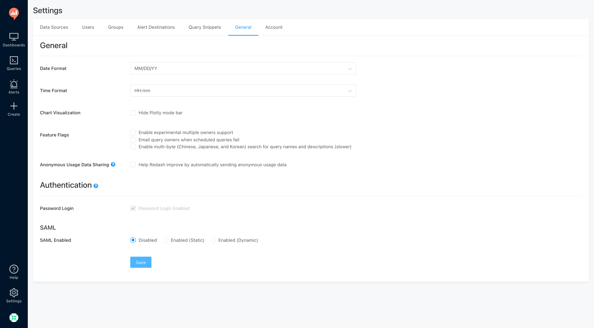

## Creating Your First Query

Click "Create → New Query" in the navigation bar and enter the following query.

```sql
SELECT * FROM country;
```

After entering it, click the "Execute" button to run the query. You will get a "list of countries".

Once the query has run, click the "New Query" text at the top left of the screen and change the query title to **"Country List"**. Don't forget to click the "Save" button on the right side of the screen.

Then click the "Publish" button at the top right of the screen. Publishing a query in Redash lets you share it with other users.

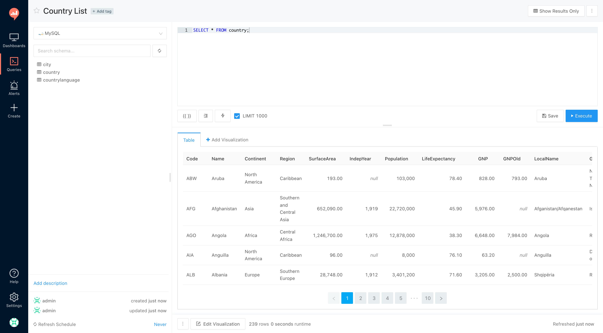

## Adding Queries to Favorites and Tagging Them

Redash supports "favorites" and "tags" for queries.

First, click the star icon to the left of the query name to add it to your favorites. Next, click the "Add tag" button to the right of the query name and register two tags: **"Analytics Team"** and **"Master Data"**.

As the number of queries grows, they become harder to find, so make good use of favorites and tags.

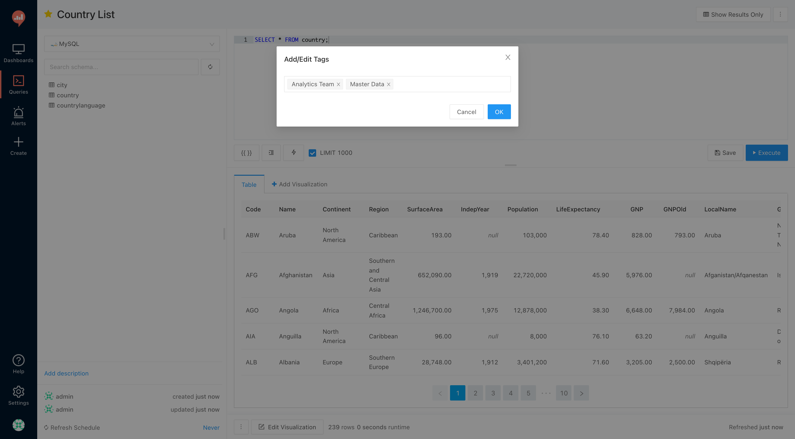

## Creating Your First Visualization

Just like before, click "Create → New Query" in the navigation bar, create a new query, and enter the following. When you run it, you will see that there are "239" countries registered. Let's visualize this number.

```sql
SELECT COUNT(*) AS COUNT FROM country;
```

Click the "+ Add Visualization" button next to the "Table" tab and configure it as follows. When you click the "Save" button, the count is displayed as a visualization. `Counter` is handy when you want to visualize a specific value, such as the latest value.

- Visualization Type
    - `Counter`
- Visualization Name
    - `Country Count`
- Counter Value Column Name
    - `COUNT`

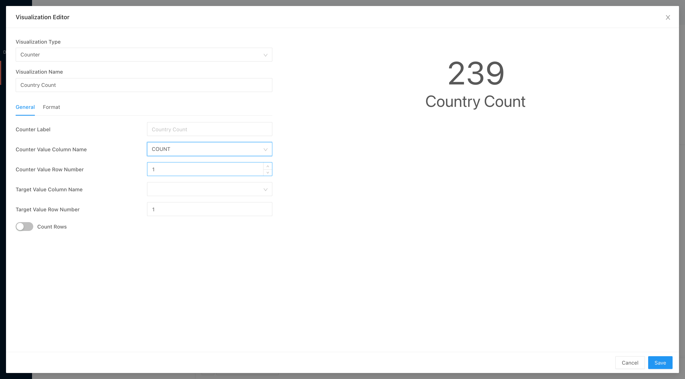

`Counter` also supports setting a "target value". The number of records in our data source does not change, but let's create one as an example. Change the previous query as follows and run it.

```sql
SELECT COUNT(*) AS COUNT, 500 AS kpi FROM country;
```

Click the "+ Add Visualization" button again and configure it as follows. The difference from the previous one is the additional "Target Value Column Name" setting. By using queries this way, you can visualize target values and actual values together.

When a `Counter` has a target value, the value is shown in red when it is below the target and in green when it is above.

- Visualization Type
    - `Counter`
- Visualization Name
    - `Country Count (+ Target)`
- Counter Value Column Name
    - `COUNT`
- Target Value Column Name
    - `kpi`

Set the query title to **"Country Count"**, and don't forget to save and publish it.

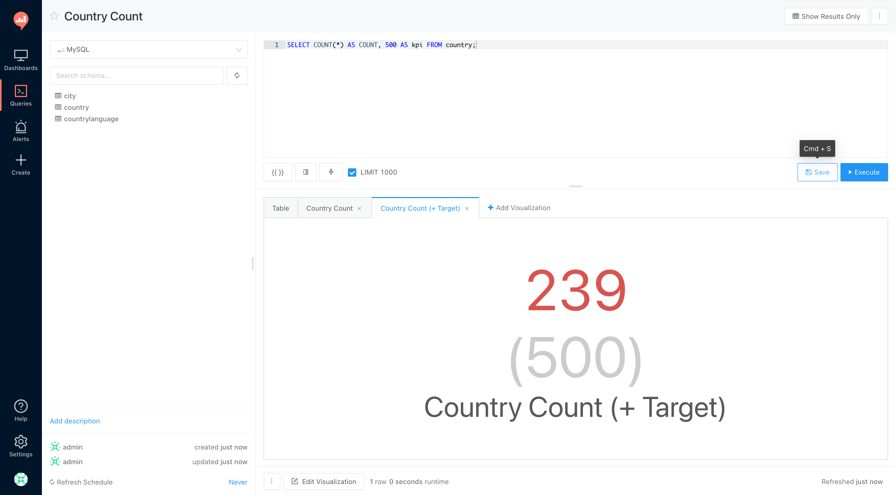

## Creating Pie Charts and Bar Charts

You should be used to creating queries by now. Create and run the following query.

It returns the number of cities per country. You can see that China and India have particularly large numbers (this is just sample data).

```sql
SELECT CountryCode, COUNT(*) AS COUNT
FROM city
GROUP BY CountryCode
ORDER BY COUNT DESC;
```

Just like before, click the "+ Add Visualization" button and configure it as follows to create a pie chart.

- Visualization Type
    - `Chart`
- Visualization Name
    - `City Count`
- General
    - Chart Type
        - `Pie`
    - X Column
        - `CountryCode`
    - Y Columns
        - `COUNT`

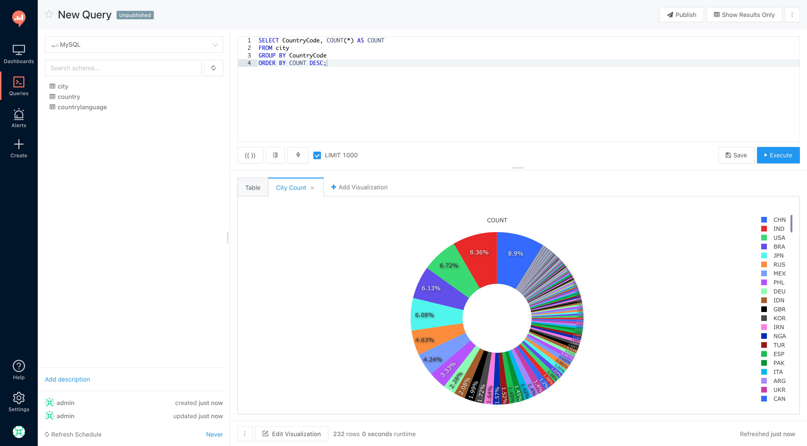

Next, let's create a bar chart as well. Configure it as follows.

- Visualization Type
    - `Chart`
- Visualization Name
    - `City Count (Bar Chart)`
- General
    - Chart Type
        - `Bar`
    - X Column
        - `CountryCode`
    - Y Columns
        - `COUNT`

However, as it is, the bars in the bar chart are in no particular order. Click the "X Axis" tab next to the "General" tab and configure the axis.

- Scale
    - `Category`
- Sort Values
    - `OFF`

Now the bar chart is ready too.

Set the query title to **"City Count"**, and don't forget to save and publish it.

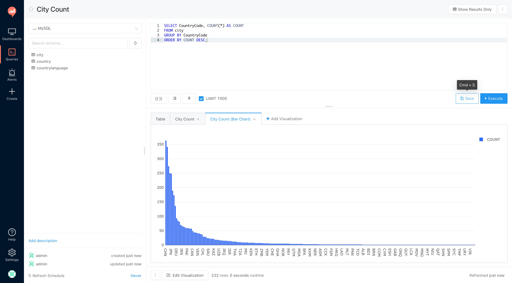

## Creating a Dashboard

Next, let's create a dashboard.

Click "Create → New Dashboard" in the navigation bar and enter **"Country Dashboard"** as the dashboard title.

Now let's place visualizations on the dashboard.

Click "Add Widget" in the menu at the bottom right of the screen. A modal called "Add Widget" appears, so repeat the following steps. Search for the query name in "Search a query by name" and choose a visualization. Feel free to change the layout as you like.

- 1st time
    - Query name
        - `Country List`
    - Choose Visualization
        - `Table`
- 2nd time
    - Query name
        - `Country Count`
    - Choose Visualization
        - `Country Count (+ Target)`
- 3rd time
    - Query name
        - `City Count`
    - Choose Visualization
        - `City Count`
- 4th time
    - Query name
        - `City Count`
    - Choose Visualization
        - `City Count (Bar Chart)`

If a query name does not show up, the query may not be published.

If you find a query in the `Unpublished` state under "Queries" in the navigation bar, publish it and try adding the visualization to the dashboard again.

Finally, click "Done Editing" at the top right of the screen, then click "Publish". Like queries, dashboards can also be shared with other users.

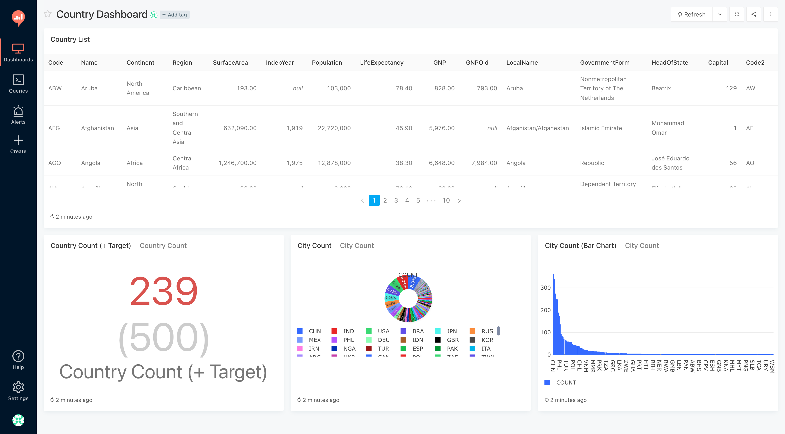

## Adding Dashboards to Favorites and Tagging Them

Redash supports "favorites" and "tags" not only for queries but also for dashboards.

First, click the star icon to the left of the dashboard name to add it to your favorites. Next, click the "Add tag" button to the right of the dashboard name and register the tag **"Analytics Team"**.

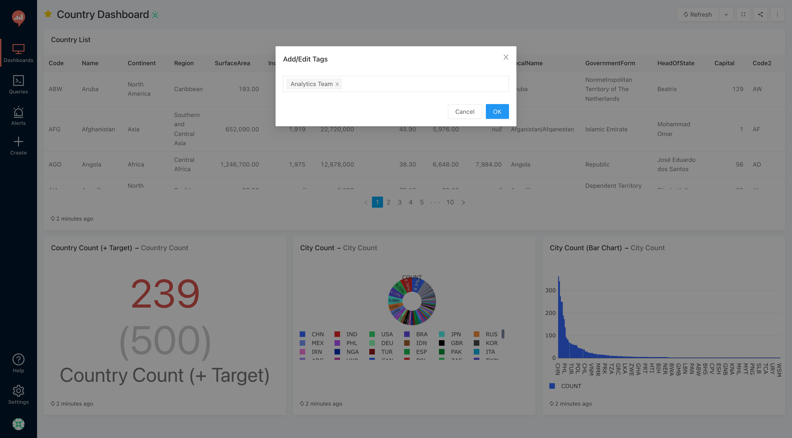

## Creating a Parameterized Query

Next, let's add a parameter to a query.

In Redash, when a query contains `{{}}`, that part becomes a parameter. Create the following new query.

By the way, after entering a query, you can format it automatically by clicking the second icon below the query editor, "Format Query". `FROM` will be moved to the third line. Give it a try.

```sql
SELECT * FROM city
WHERE CountryCode = '{{CountryCode}}'
ORDER BY Population DESC;
```

A text area for entering the "CountryCode" parameter appears at the bottom left of the screen.

Enter "JPN" there and click "Apply Changes" to get the cities of Japan sorted by population in descending order. Set the query title to **"City Search (Parameter)"** and save it.

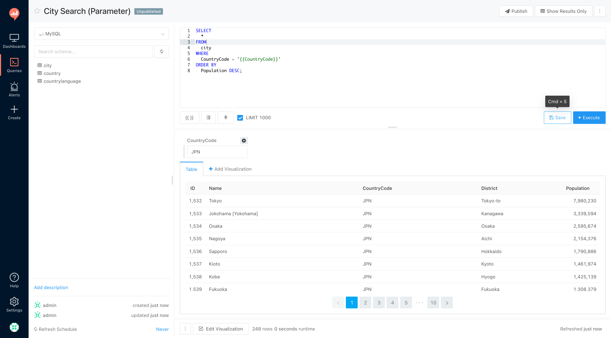

Parameters can be entered through UIs other than a text field. As the names suggest, choosing "Date", for example, lets you pick a date from a date picker (calendar).

- Text
- Number
- Dropdown List
- Query Based Dropdown List
- Date
- Date and Time
- Date and Time (with seconds)
- Date Range
- Date and Time Range
- Date and Time Range (with seconds)

This time, let's try the convenient "Dropdown List".

Click the toggle next to the parameter and set "Type" to `Dropdown List`. Then set the following list as "Values".

```
JPN
USA
AUS
```

Now you can choose from a list of options, which helps prevent input mistakes. Select "AUS" and click "Apply Changes".

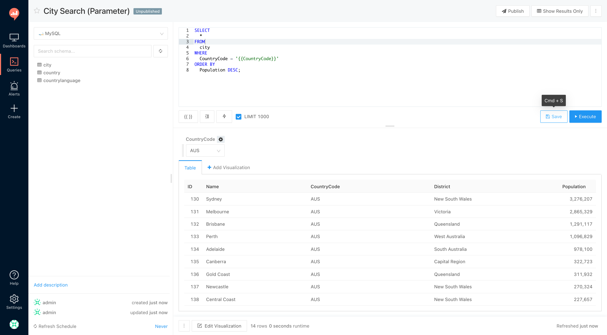

## Creating a Parameterized Query (Multiple Values)

You can also select multiple parameter values. Create the following new query.

```sql
SELECT *
FROM city
WHERE CountryCode IN ({{CountryCode}})
ORDER BY Population DESC;
```

Click the toggle next to the parameter and set "Type" to `Dropdown List`. Then set the following list as "Values", check "Allow multiple values", and choose "Single Quotation Mark" for "Quotation".

```
JPN
USA
AUS
```

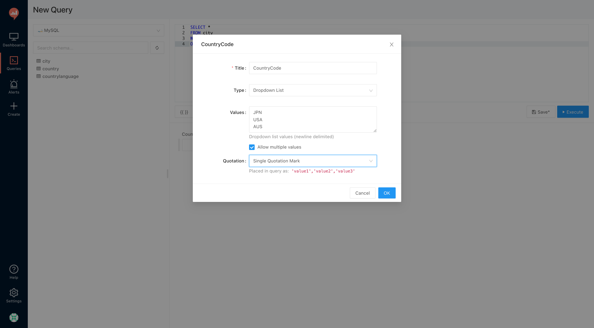

Now you can select multiple values from the options. This time, select "JPN" and "AUS" and click "Apply Changes".

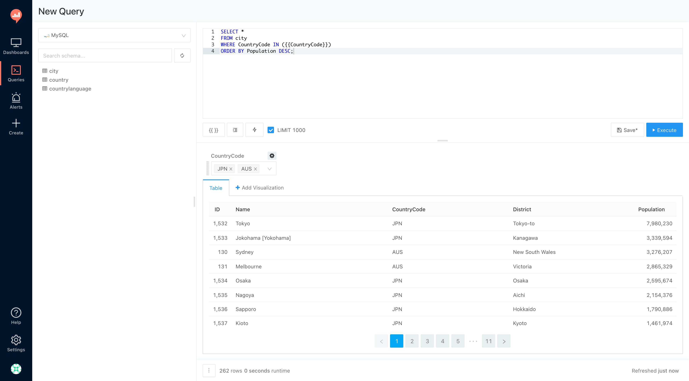

Set the query title to **"City Search (Multiple Parameters)"** and save it.

## Using Filters

In Redash, if you name a query column `column_name::filter` or `column_name::multi-filter`, you can filter the query results. Let's try it right away.

Create and run the following new query, and you will be able to filter the results freely by "CountryCode". This is the "filter" feature.

```sql
SELECT *, CountryCode AS 'CountryCode::filter'
FROM city
ORDER BY Population DESC;
```

Next, let's try the "multi-filter" feature. Change the query as follows, and this time you can filter by multiple "CountryCode" values. Run "Format Query" again here as well.

```sql
SELECT *, CountryCode AS 'CountryCode::multi-filter'
FROM city
ORDER BY Population DESC;
```

Filters are extremely useful. See the official documentation for details.

- [Query Filters | Redash](https://redash.io/help/user-guide/querying/query-filters)

Set the query title to **"City Filter"** and save it.

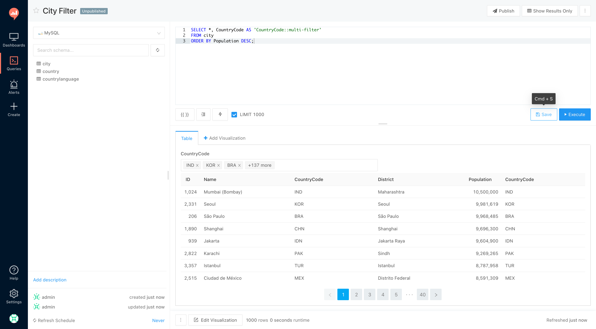

## Using Query Snippets

Redash lets you register frequently used queries (or parts of queries) as query snippets.

Click the Settings icon at the bottom left of the screen, then click the "Query Snippets" tab.

Next, click the "New Query Snippet" button to open the registration form. Fill it in as follows and press the "Create" button.

- Trigger
    - `_country_code`
- Description
    - `Search by country code`
- Snippet
    - `WHERE CountryCode = '{{CountryCode}}'`

Create a new query and enter the following. Since snippets are suggested when the input partially matches their "Trigger", typing `_` brings up the query snippet.

```sql
SELECT * FROM city _
```

You can also set placeholders in query snippets.

If you configure `${1:table}` as shown below, it becomes a placeholder for a table name. Give it a try. The goal here is just to see how query snippets work, so you don't need to save this query.

- Trigger
    - `_record_count`
- Description
    - `Record count`
- Snippet
    - `SELECT COUNT(*) FROM ${1:table};`

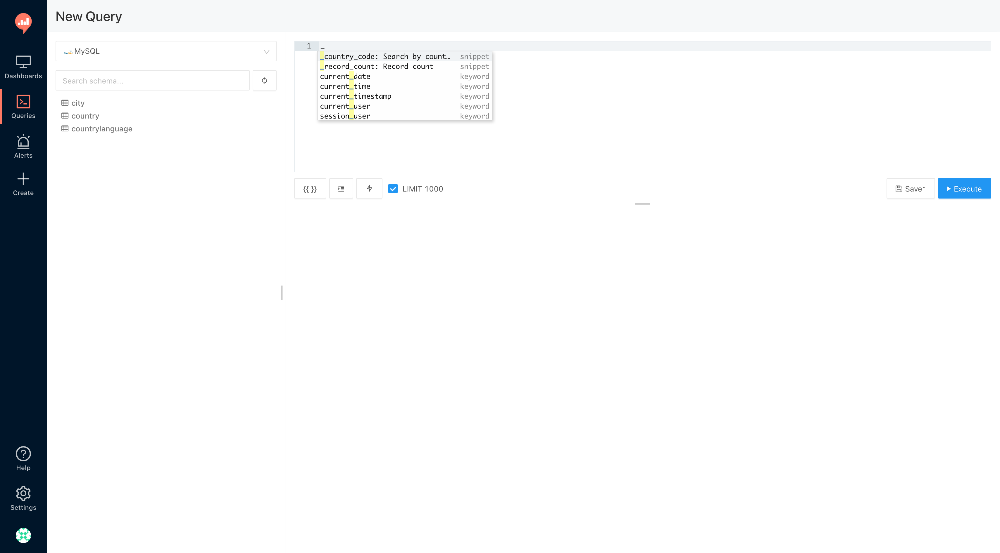

## Coloring Query Results

In Redash, you can embed HTML in query results. Create the following new query right away.

```sql
SELECT Code,
       Name,
       Population,
       CASE
           WHEN Population > 1000000000 THEN '<div class="bg-success p-30 text-center">AAA</div>'
           WHEN Population > 213000000 THEN '<div class="bg-warning p-20 text-center">BBB</div>'
           ELSE '<div class="bg-danger p-10 text-center">CCC</div>'
       END AS Color
FROM country
ORDER BY Population DESC;
```

The color changes between "green, yellow, and red" depending on the value of "Population". The height also changes. Using HTML this way makes query results even more useful.

Set the query title to **"Country List (Colored)"** and save it.

Note that, for security reasons, HTML in query results is no longer rendered by default. Click the "Edit Visualization" button at the bottom of the screen, open the "Color" column in the "Columns" tab, enable "Allow HTML content", and click the "Save" button. The HTML will then be rendered.

There are other markups you can use, and they are listed in the official documentation.

- [Conditional Formatting & General Text Formatting - Tips, Tricks & Query Examples - Redash Discourse](https://discuss.redash.io/t/conditional-formatting-general-text-formatting/1706)

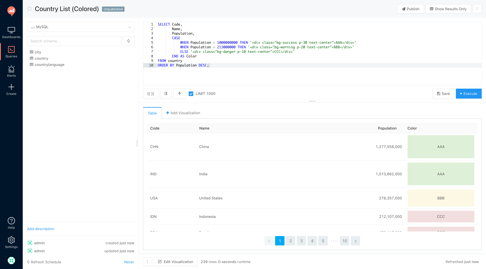

## Creating a Collection of Links

When you place multiple visualizations on a dashboard, it can be handy to include related URLs as well.

You could add free text to a dashboard, but since Redash can embed HTML in query results, you can easily create links this way instead.

Create the following new query and set the query title to **"Links"**, then save it. Here too, click the "Edit Visualization" button, enable "Allow HTML content" for the "name" column in the "Columns" tab, and click the "Save" button.

```sql
SELECT '<a href="https://www.google.co.jp/" target="_blank">Google</a>' AS name
UNION
SELECT '<a href="https://www.yahoo.co.jp/" target="_blank">Yahoo!</a>'
UNION
SELECT '<a href="https://www.bing.com/" target="_blank">Bing</a>'
UNION
SELECT '<a href="https://kakakakakku.hatenablog.com/" target="_blank">kakakakakku blog</a>';
```

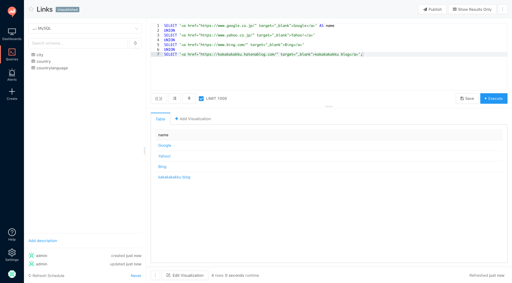

## Executing a Selected Part of a Query

Redash can execute only the selected part of a query.

When writing analytical queries, you often use subqueries and JOINs. Being able to select and run just a partial query, such as a subquery, is convenient.

Create the following new query, select the subquery, and click the "Execute Selected" button to run it.

```sql
SELECT *
FROM country
WHERE Code =
    (SELECT Code
     FROM country
     WHERE Name = 'Japan')
```

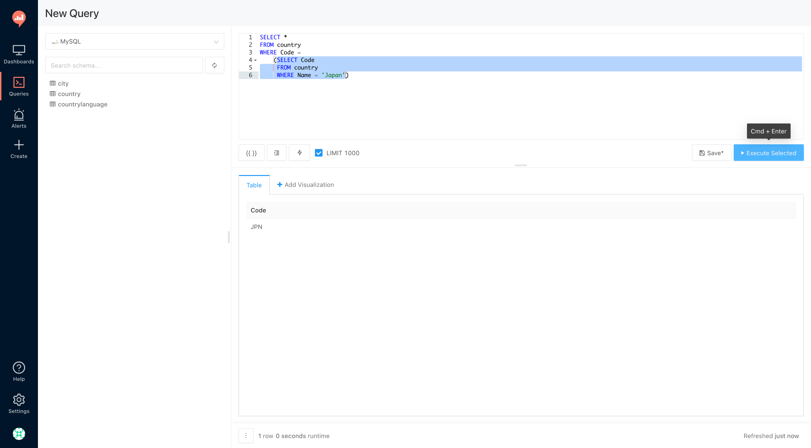

## Downloading Query Results

Redash lets you download query results. The currently supported formats are CSV, TSV, and Excel.

Click "Queries" in the navigation bar and open the **"Country List"** query you created earlier.

> [!TIP]
> If you see "Query has no result", click the "Refresh Now" button.

Press the vertical three-dot button at the bottom of the screen (two buttons to the left of the Edit Visualization button) to open the following menu. Try downloading the query results.

- Download as CSV File
- Download as TSV File
- Download as Excel File

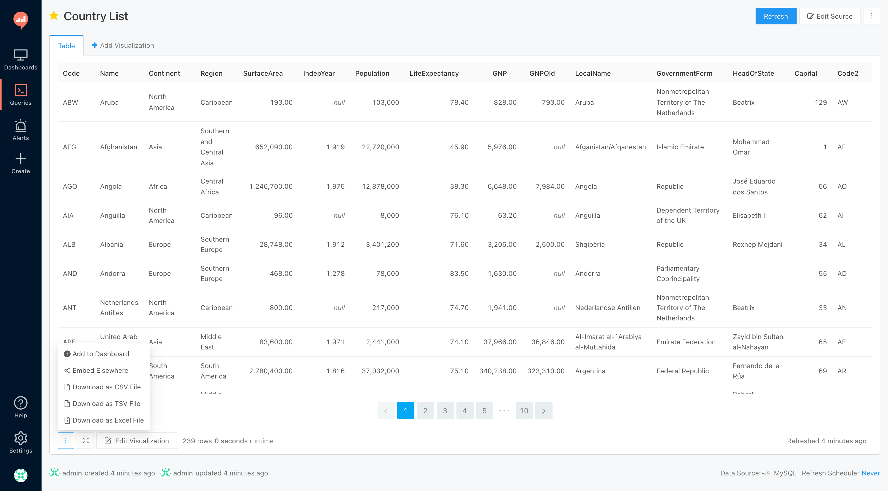

## Trying the Query Fork Feature

In this tutorial you are using Redash alone, but in practice it is often used by a team.

When working in a team, you will sometimes think, **"I want to tweak a query created by a teammate."** That is what the "fork" feature in Redash is for.

Open the **"Country List"** query you created earlier and click the "Fork" button in the vertical three-dot menu at the top right of the screen. A new query is created automatically. Change the query title from **"Copy of (#1) Country List"** to **"Country List (Customized)"**.

You can freely modify the query, so enter and run the following. The displayed columns are now customized to "country code", "name", and "population". Run "Format Query" again here as well.

```sql
SELECT Code, Name, Population FROM country;
```

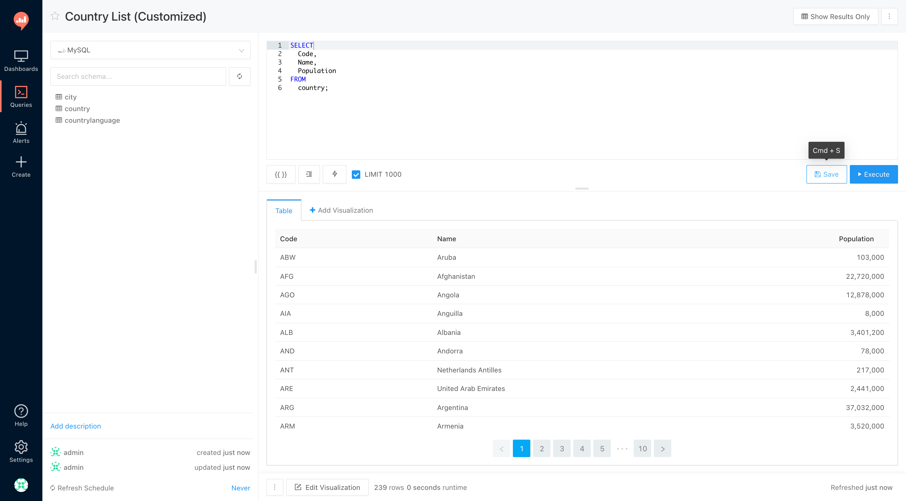

## Setting Up an Alert

Redash is not just for visualization. It can also send an alert notification when a value exceeds a threshold. You can choose from the following notification destinations.

- Email
- Slack
- Webhook
- Discord
- Mattermost
- ChatWork
- PagerDuty
- Google Hangouts Chat
- Microsoft Teams Webhook
- Asana
- Webex
- Datadog

Let's send an alert to Slack via a webhook. This section assumes you have a Slack account you can freely use.

First, create an Incoming Webhook in Slack. It works as is, but it is convenient to set "App name" to `Redash Alerts` and "App icon" to something like the Redash logo in the Basic Information of your Slack App. You will use the generated "Webhook URL" value in the next step.

> [!TIP]
> How to configure Incoming Webhooks is described in [Sending messages using incoming webhooks | Slack](https://api.slack.com/messaging/webhooks).

Click the Settings icon at the bottom left of the screen, then click the "New Alert Destination" button in the "Alert Destinations" tab. Next, click "Slack" and configure the registration form as follows.

- Name
    - `Slack`
- Slack Webhook URL
    - `Webhook URL`

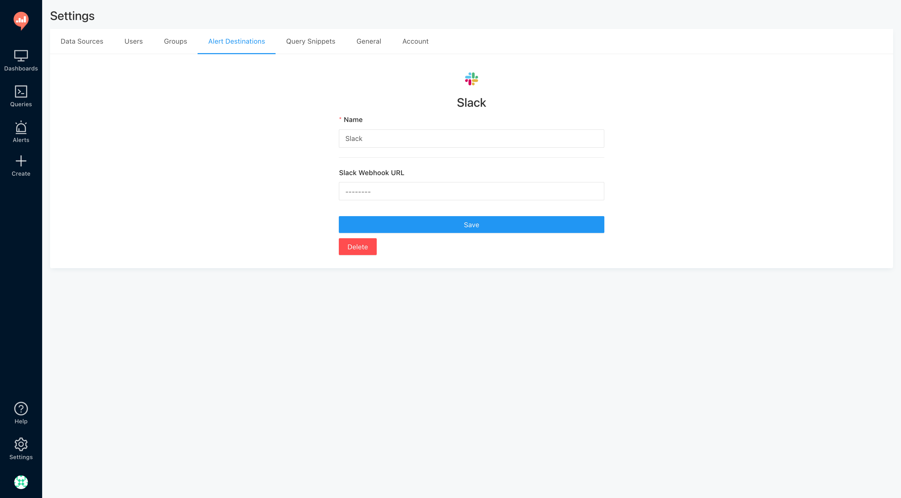

Before setting up the alert, a little more preparation is needed.

Open the "Country Count" query you created earlier and click "Edit Source".

> [!TIP]
> If you see "Query has no result", click the "Refresh Now" button.

You also need to enable the "Refresh Schedule" at the bottom left of the screen. Click "Never" and set it to `1 minute` for this tutorial.

In this example the number of countries does not change, but this feature runs the query periodically. A query used for an alert must have a "Refresh Schedule" configured.

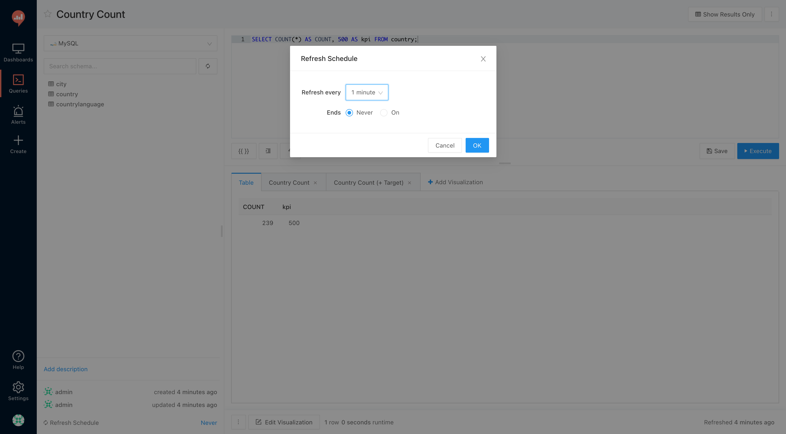

Finally, let's configure the alert. Click "Create → New Alert" in the navigation bar to open the "New Alert" screen.

Configure the form as follows.

- Query
    - `Country Count`
- Trigger when
    - `[first] COUNT > 200`
- When triggered, send notification
    - `Each time alert is evaluated`
- Template
    - `Use default template`
- Name (at the top of the screen)
    - `Country count exceeded 200`

When you click "Create Alert", the "Destinations" menu appears on the right side, so "Add" the "Slack" destination.

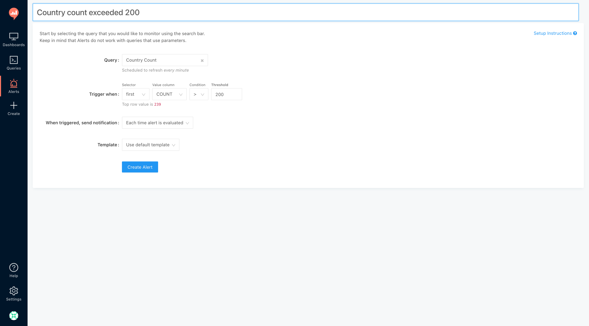

Then the alert is sent to Slack. Once you have confirmed it, remove "Slack" from "Destinations".

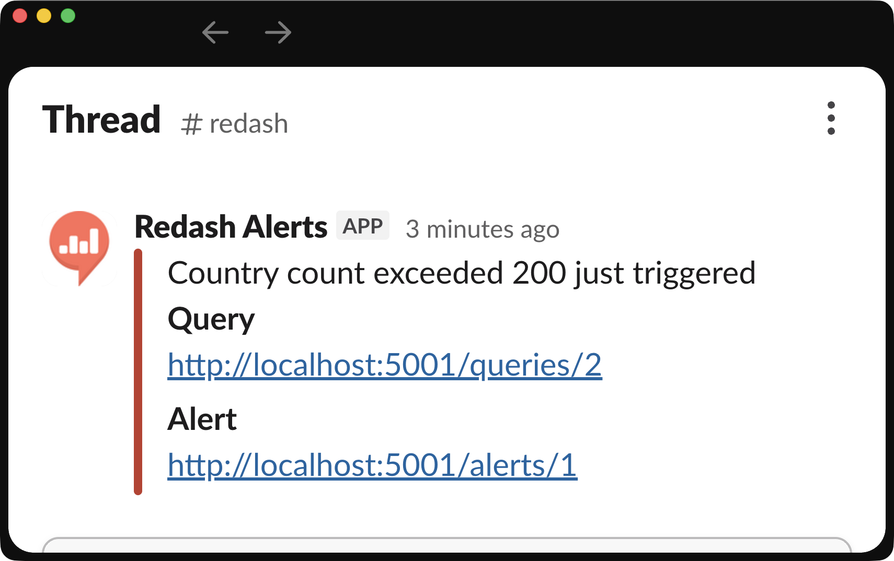

## Adding and Disabling Redash Users

Next, as a Redash administrator, let's walk through the steps to add and disable Redash users.

Click the Settings icon at the bottom left of the screen, then click the "Users" tab. Next, click the "New User" button.

Register two Redash users as follows. After registering, click "Pending Invitations" to check the users. They are in the invited state.

- Create a New User (1st time)
    - Name
        - `RedashUser1`
    - Email
        - `redashuser1@example.com`
- Create a New User (2nd time)
    - Name
        - `RedashUser2`
    - Email
        - `redashuser2@example.com`

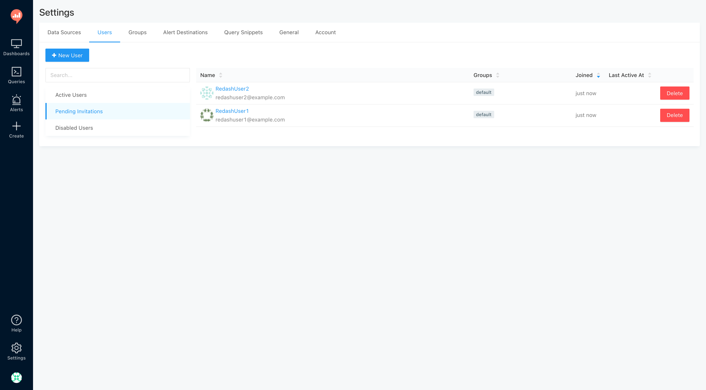

What should you do when you need to remove a Redash user, for example when a member leaves the company?

Redash does not have a feature to delete users, but you can disable them. Let's disable one of the invited users.

Click "RedashUser2" in "Pending Invitations" and press the "Disable User" button. The user is now disabled. Click "Disabled Users" to see the disabled users.

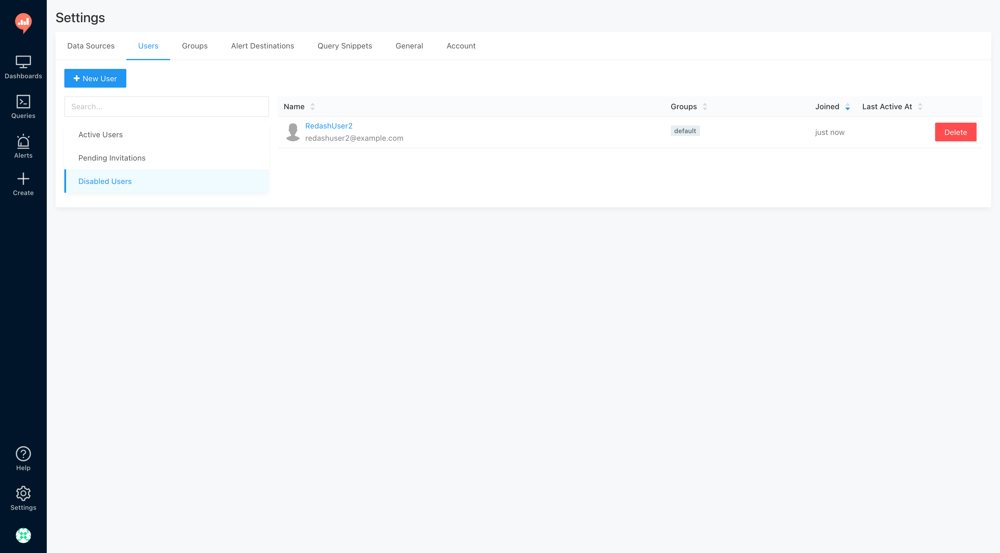

That's the end of this hands-on tutorial! Let's stop Redash. Well done!

```sh
$ docker compose down
```

Happy querying :)
